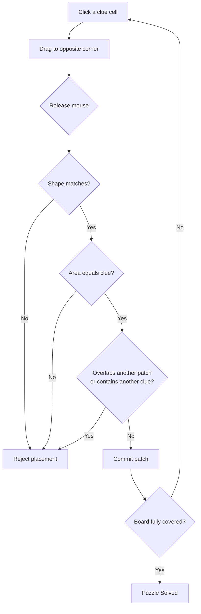
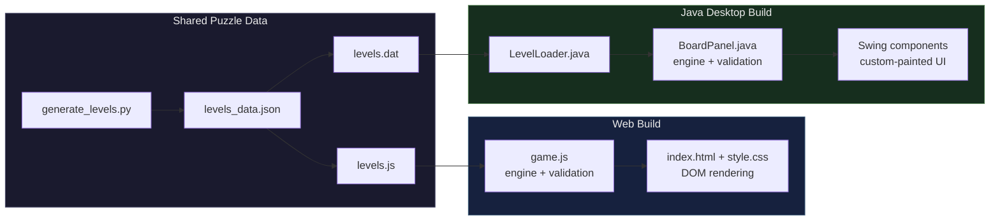
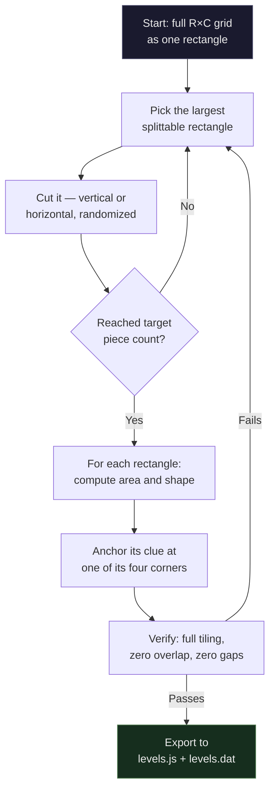

<div align="center">


<br/>


<br/><br/>


</div>

<br/>

<p align="center">

</p>

<br/>

---

<div align="center">

### Table of Contents

**[About](#about)** · **[Preview](#preview)** · **[Features](#features)** · **[How to Play](#how-to-play)** · **[Architecture](#architecture)** · **[Project Structure](#project-structure)** · **[File Reference](#file-reference)** · **[Level Generator](#level-generator)** · **[Getting Started](#getting-started)** · **[Validation](#validation--testing)** · **[Roadmap](#roadmap)**

</div>

---

<br/>

## About

**Patches** is an original, independently built puzzle inspired by the mechanics of a well-known daily rectangle-partition game. The underlying logic draws from the classic **Shikaku** family of puzzles: every numbered cell is a clue, and the goal is to draw a rectangle around it whose area matches the number — until the entire grid is tiled edge-to-edge with no gaps and no overlaps.

This repository ships **two complete, independent implementations of the same 32 puzzles**:

<table>
<tr>
<th align="left" width="16%">Version</th>
<th align="left" width="44%">Stack</th>
<th align="left" width="40%">Best For</th>
</tr>
<tr>
<td><strong>Web</strong></td>
<td>Vanilla HTML5, CSS3, JavaScript (ES6) — no frameworks, no build tools</td>
<td>Opening instantly in any browser, hosting on GitHub Pages, or embedding anywhere</td>
</tr>
<tr>
<td><strong>Java Desktop</strong></td>
<td>Java 17+, Swing, custom-painted UI components</td>
<td>Running as a native, fully offline desktop app with no browser dependency</td>
</tr>
</table>

Both versions consume **identical puzzle data**, generated once by a single Python script (`generate_levels.py`) and exported into two formats — a JavaScript array for the web build, and a compact text encoding for the Java build. A fix or a new level batch only ever needs to be generated once.

> **Disclaimer** — This is a fan-made, independently engineered project built for educational and portfolio purposes. It is not affiliated with, endorsed by, or connected to any commercial product. No proprietary code, assets, or puzzle data were used; only the publicly observable rules of the genre were reimplemented from scratch.

<br/>

---

## Preview

<div align="center">
<table>
<tr>
<td align="center" width="33%">

<br/><sub><strong>Level Select</strong> — 32 levels grouped by grid-size tier</sub>
</td>
<td align="center" width="33%">

<br/><sub><strong>Fresh Puzzle</strong> — clues showing target area and shape</sub>
</td>
<td align="center" width="33%">

<br/><sub><strong>Solved Board</strong> — every cell claimed by exactly one patch</sub>
</td>
</tr>
</table>

<sub>Screenshots shown are from the Java desktop build — the web build shares an identical visual theme.</sub>

</div>

<br/>

---

## Features

<table>
<tr>
<td width="50%" valign="top">

**Puzzle Engine**
- 32 hand-planned, solver-verified levels
- 6 difficulty tiers, 5×5 through 10×10 expert
- Guillotine-cut generator with corner-anchored clues
- Full tiling guaranteed — no gaps, no overlaps, ever

**Visual Design**
- Custom "quilted-canvas" theme with stitched borders and a fabric-swatch palette
- Fredoka + Inter typography bundled in both builds
- Smooth drag-preview feedback — green for valid, red for invalid

</td>
<td width="50%" valign="top">

**Gameplay**
- Click-and-drag rectangle placement, corner to corner
- Undo, Reset, and Hint (reveals one unsolved patch)
- Live timer with best-time tracking per level
- Daily featured puzzle, deterministic by date
- Persistent progress — solved levels, streaks, best times

**Delivery**
- Web: open `index.html` — done
- Desktop: double-click one `.jar` — done
- No installers, no accounts, no telemetry

</td>
</tr>
</table>

<br/>

---

## How to Play

<table>
<tr>
<td width="58%" valign="top">

| Step | Action |
|:---:|---|
| 1 | Every numbered cell is a **clue** — the number is the exact cell count its rectangle must cover |
| 2 | The icon under the number shows the required **shape**: square, tall, or wide |
| 3 | **Click** a clue and **drag** to the opposite corner of the intended rectangle |
| 4 | **Release** to commit — the patch turns green if valid, flashes red if not |
| 5 | Every rectangle must contain **exactly one clue**, and rectangles can never overlap |
| 6 | The puzzle is solved the instant **every cell** on the board belongs to a patch |
| — | Click any placed patch to remove it, or use **Undo**, **Reset**, or **Hint** |

</td>
<td width="42%" valign="top">



</td>
</tr>
</table>

<br/>

---

## Architecture

Both builds share the exact same three-layer structure — only the rendering layer differs.



`game.js` and `BoardPanel.java` implement an **identical validation ruleset** — shape check → area check → overlap check → single-clue check — line-for-line equivalent logic in two languages, so any puzzle solvable in one build is guaranteed solvable in the other.

<br/>

---

## Project Structure

```
patches-game/
│
├── index.html                    Web app entry point — screens and modals
├── style.css                     Full visual theme (quilted-canvas design)
├── game.js                       Web game engine — render, drag, validate, win
├── levels.js                     32 generated puzzles (web format)
├── generate_levels.py            Puzzle generator — source of truth for both builds
├── README.md                     You are here
│
├── assets/
│   └── screenshots/               Gameplay screenshots used in this README
│
└── java-desktop-version/
    │
    ├── patches-game.jar           Double-click to run — everything bundled inside
    ├── README-JAVA.md             Java-specific setup and rebuild instructions
    ├── MANIFEST.MF                Jar manifest — declares the Main-Class
    │
    ├── src/patches/                All Java source (14 files, see reference below)
    │
    ├── resources/
    │   ├── levels.dat               32 generated puzzles (Java format)
    │   └── fonts/                   Bundled Fredoka + Inter TTFs
    │
    └── licenses/                  OFL license text for the bundled fonts
```

<br/>

---

## File Reference

### Web version

<table>
<tr><th align="left" width="22%">File</th><th align="left">Role</th></tr>
<tr>
<td><code>index.html</code></td>
<td>The page shell. Defines the level-select screen, the game screen (toolbar and board container), the win modal, and the how-to-play modal. Loads fonts, <code>style.css</code>, <code>levels.js</code>, then <code>game.js</code>.</td>
</tr>
<tr>
<td><code>style.css</code></td>
<td>All visual styling — the color palette and typography as CSS variables, the fabric-and-stitching aesthetic (dashed borders, patch-edge borders), button and modal styles, and responsive rules for mobile.</td>
</tr>
<tr>
<td><code>game.js</code></td>
<td>The entire client-side engine in one file: board state, DOM rendering, pointer-event drag handling, the <code>validatePlacement()</code> rule-checker, win detection, the timer, hint logic, and <code>localStorage</code>-backed progress persistence.</td>
</tr>
<tr>
<td><code>levels.js</code></td>
<td>Auto-generated data file — a single <code>PATCHES_LEVELS</code> array of 32 level objects (rows, columns, and each clue's position, value, shape, and solution). Never hand-edited; regenerate it via the Python script instead.</td>
</tr>
<tr>
<td><code>generate_levels.py</code></td>
<td>The puzzle generator. Recursively splits each grid into rectangles via a guillotine-cut partition, classifies each piece's shape, anchors its clue at a corner, and verifies the result tiles perfectly before writing <code>levels.js</code>.</td>
</tr>
</table>

### Java desktop version — `src/patches/`

<table>
<tr><th align="left" width="22%">File</th><th align="left">Role</th></tr>
<tr>
<td><code>PatchesApp.java</code></td>
<td><strong>Main entry point.</strong> Builds the <code>JFrame</code>, header, footer, and the <code>CardLayout</code> that swaps between the level-select and game screens. Owns the <code>Progress</code> instance and wires every screen's callbacks together.</td>
</tr>
<tr>
<td><code>LevelLoader.java</code></td>
<td>Parses the bundled <code>levels.dat</code> resource — a compact <code>id|rows|cols|clue;clue;...</code> text format — into a list of <code>Level</code> objects at startup.</td>
</tr>
<tr>
<td><code>Level.java</code></td>
<td>Data model for one puzzle: id, dimensions, and its list of <code>Clue</code> objects.</td>
</tr>
<tr>
<td><code>Clue.java</code></td>
<td>Data model for a single clue: cell position, required area, required <code>Shape</code>, and the generator's reference solution rectangle, used only for hints.</td>
</tr>
<tr>
<td><code>Shape.java</code></td>
<td>Enum of the three shape categories — <code>SQUARE</code>, <code>TALL</code>, <code>WIDE</code>.</td>
</tr>
<tr>
<td><code>BoardPanel.java</code></td>
<td><strong>The core game engine.</strong> A custom <code>JPanel</code> that paints the grid, clue badges, and placed patches; handles all mouse-drag interaction; and implements the same shape → area → overlap → single-clue validation ruleset as <code>game.js</code>. Also owns undo, reset, hint, and win detection.</td>
</tr>
<tr>
<td><code>GamePanel.java</code></td>
<td>The game screen's chrome — back button, level badge, live timer, and the Hint / Undo / Reset toolbar — wrapped around a <code>BoardPanel</code>.</td>
</tr>
<tr>
<td><code>LevelSelectPanel.java</code></td>
<td>Renders the scrollable, tier-grouped grid of level tiles, the daily-puzzle marker, solved checkmarks, and the "Play today's puzzle" / "How to play" actions.</td>
</tr>
<tr>
<td><code>WrapLayout.java</code></td>
<td>A small utility layout manager — a <code>FlowLayout</code> that correctly wraps rows inside a scroll pane — used by the level tile grid.</td>
</tr>
<tr>
<td><code>RoundedButton.java</code></td>
<td>Custom pill-shaped, hover-responsive button component matching the web app's <code>.btn</code> style, used throughout in place of default Swing button chrome.</td>
</tr>
<tr>
<td><code>WinDialog.java</code></td>
<td>The puzzle-complete dialog — shows solve time, best time, and Next Level / All Levels actions.</td>
</tr>
<tr>
<td><code>HowToDialog.java</code></td>
<td>The rules and instructions dialog, styled to match the rest of the app.</td>
</tr>
<tr>
<td><code>Progress.java</code></td>
<td>Reads and writes <code>~/.patches-game/progress.properties</code> — solved levels, best times per level, and the daily play streak.</td>
</tr>
<tr>
<td><code>Theme.java</code></td>
<td>Centralized color palette (mirrors the CSS variables exactly) and font loading — registers the bundled Fredoka / Inter TTFs at startup, falling back to system fonts if that fails.</td>
</tr>
</table>

### Java desktop version — supporting files

<table>
<tr><th align="left" width="22%">File</th><th align="left">Role</th></tr>
<tr>
<td><code>patches-game.jar</code></td>
<td>The final, runnable artifact. Contains all compiled classes, <code>levels.dat</code>, and both font files — fully self-sufficient.</td>
</tr>
<tr>
<td><code>MANIFEST.MF</code></td>
<td>One line — <code>Main-Class: patches.PatchesApp</code> — tells the JVM what to launch when the jar is run directly.</td>
</tr>
<tr>
<td><code>resources/levels.dat</code></td>
<td>The same 32 puzzles as <code>levels.js</code>, re-encoded into a compact pipe/comma-delimited text format for fast, dependency-free parsing in Java.</td>
</tr>
<tr>
<td><code>resources/fonts/*.ttf</code></td>
<td>Fredoka (display) and Inter (body), bundled so the desktop app looks identical everywhere regardless of installed system fonts.</td>
</tr>
<tr>
<td><code>licenses/OFL-*.txt</code></td>
<td>SIL Open Font License text for the two bundled fonts, included per license requirements.</td>
</tr>
<tr>
<td><code>README-JAVA.md</code></td>
<td>A focused setup and rebuild guide for just the Java build.</td>
</tr>
</table>

<br/>

---

## Level Generator

Every one of the 32 levels is produced algorithmically, then rigorously verified before shipping — nothing is placed by hand, and nothing ships unverified.



**Difficulty scaling** — six tiers, five puzzles each, plus two expert bonus puzzles:

<div align="center">

| Levels | Grid | Pieces | Difficulty |
|:---:|:---:|:---:|:---|
| 1 – 6 | 5×5 | 5 – 8 | Easy |
| 7 – 12 | 6×6 | 7 – 10 | Easy–Medium |
| 13 – 18 | 7×7 | 9 – 12 | Medium |
| 19 – 24 | 8×8 | 11 – 14 | Medium–Hard |
| 25 – 30 | 9×9 | 13 – 16 | Hard |
| 31 – 32 | 10×10 | 17 – 18 | Expert |

</div>

Clues are corner-anchored — never placed mid-rectangle — specifically so a corner-to-corner mouse drag can always reconstruct the intended shape, matching the real feel of drag-based rectangle puzzles.

<br/>

---

## Getting Started

### Option A — Web version

```bash
# Just open it — no install, no server needed
cd patches-game
open index.html        # macOS
xdg-open index.html    # Linux
start index.html       # Windows
```

If your browser blocks local file access for any reason, serve it instead:

```bash
python3 -m http.server 8000
# then visit http://localhost:8000
```

### Option B — Java desktop version

Requires a Java 17+ runtime (`java -version` to check; install via `sudo apt install default-jre` or [adoptium.net](https://adoptium.net) if missing).

```bash
cd patches-game/java-desktop-version
java -jar patches-game.jar
```

Or double-click `patches-game.jar` if your OS associates `.jar` files with Java.

### Rebuilding the Java app from source

```bash
cd patches-game/java-desktop-version
mkdir -p out
javac -encoding UTF-8 -d out src/patches/*.java
cp -r resources/fonts out/fonts
cp resources/levels.dat out/levels.dat
jar cfm patches-game.jar MANIFEST.MF -C out .
```

### Regenerating levels

```bash
cd patches-game
python3 generate_levels.py
```

Edit `level_plan()` inside the script to change grid sizes, level count, or difficulty per tier. This overwrites `levels.js`, which can then be re-encoded into `levels.dat` for the Java build.

<br/>

---

## Validation & Testing

Every level shipped in this repo passed through three independent verification passes before being included:

<table>
<tr><th align="left" width="30%">Check</th><th align="left">What It Confirms</th></tr>
<tr>
<td>Structural validation</td>
<td>No duplicate clue coordinates; every clue's area sums exactly to the grid's total cell count</td>
</tr>
<tr>
<td>Geometric validation</td>
<td>The generator's own solution rectangles tile the grid with zero overlap and zero gaps, and every clue sits on a corner of its own rectangle</td>
</tr>
<tr>
<td>Engine simulation</td>
<td>Each level was "played" programmatically using the exact same validation function shipped in <code>game.js</code>, confirming every puzzle is solvable through the real game rules — not just by construction</td>
</tr>
</table>

The Java build was additionally verified by driving the real UI: a `Robot`-based test harness performed genuine mouse press/drag/release sequences through every clue of a live, rendered window and confirmed the board reached a fully-solved state — exercising the actual production code path, not a shortcut.

<br/>

---

## Roadmap

<table>
<tr>
<td width="33%" valign="top">

**Near-term**
- [ ] Daily-puzzle cloud sync
- [ ] Difficulty-rated hint costs
- [ ] Sound effects toggle

</td>
<td width="33%" valign="top">

**Mid-term**
- [ ] Level editor / custom puzzle sharing
- [ ] Mobile-native wrapper (Android/iOS)
- [ ] Colorblind-friendly palette mode

</td>
<td width="33%" valign="top">

**Long-term**
- [ ] Multiplayer race mode
- [ ] Procedural infinite mode
- [ ] Leaderboards

</td>
</tr>
</table>

<br/>

---

<div align="center">

### Contributing

Found a bug? Open an issue. Have an idea for a level pack? Open a pull request.

<br/>


<br/><br/>

<sub>Built with care, verified with code, and inspired by a genuinely fun little puzzle format.</sub>

</div>


